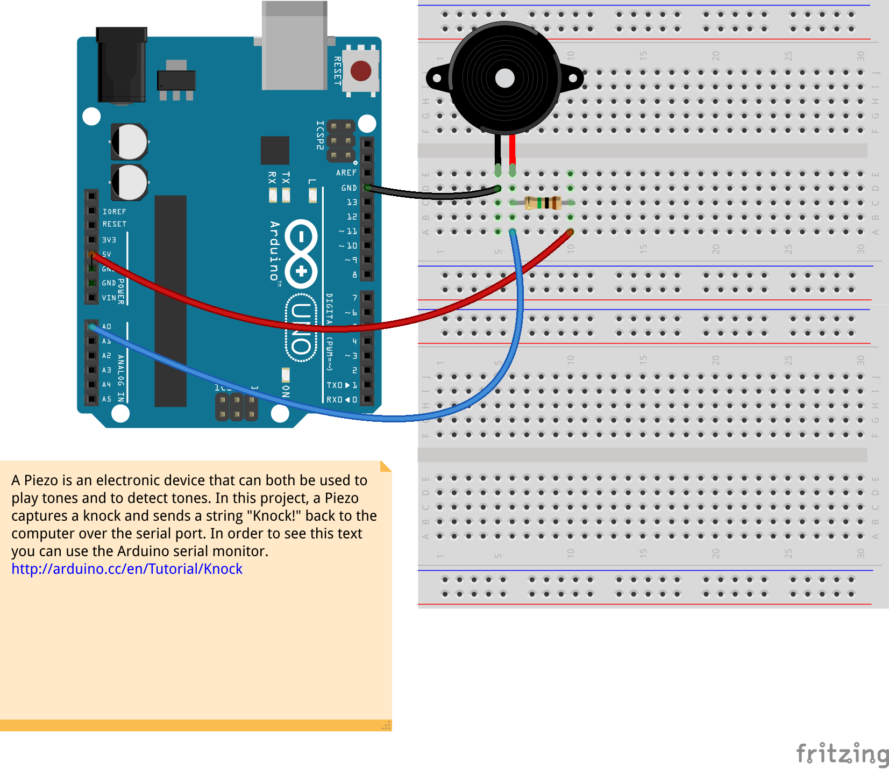

Piezo
=====

These example uses a piezo speaker to play melodies and detect knocks.

It sends a square wave of the appropriate frequency to the piezo, generating the corresponding tone and listens to analog inputs.  

###Piezo as output:  

- drunk_rider.ino 
- rocky.ino

  
Based on work by  by Tom Igoe ([arduino.cc/en/Tutorial/tone](http://arduino.cc/en/Tutorial/tone)) and  by Dejan Milenkovits from [malmö University at the institution of art, culture and communication](https://ioio.mah.se/).  

Thanks to [Olive Christou](http://olivia-uhlig.me/) for figuring out the rocky melody and making the pauses better with me.

###Piezo as input:  
- knock.ino  
  

Knock by [David Cuartielles](http://www.0j0.org) modified by Tom Igoe from here [arduino.cc/en/tutorial/knock](http://arduino.cc/en/tutorial/knock)

